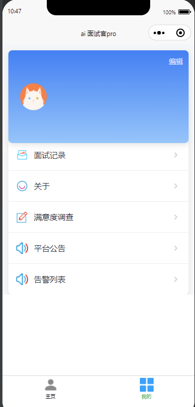
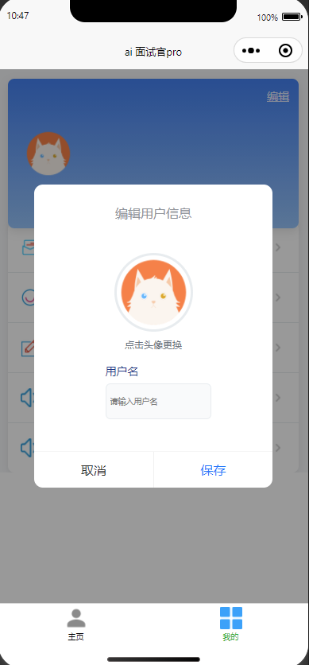
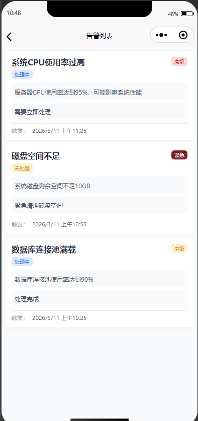

# AI-Interview-MP

## 项目简介

**AI-Interview-MP** 是一个专为小程序端设计的 AI 面试官应用，旨在为用户提供智能、便捷的模拟面试体验。通过该应用，用户可以进行个性化的面试练习，获取实时反馈，并查看详细的面试记录，从而提升面试技巧和表现。

---

## 功能特点

- **智能面试模拟**：基于 AI 技术，提供逼真的面试场景和问题。
- **面试记录**：保存每次面试的详细记录，方便用户回顾和分析。
- **用户友好的界面**：简洁直观的 UI 设计，优化用户体验。
- **题库与模型选择**：支持按分类选择题库，选择不同 AI 模型，灵活组合练习场景。
- **头像与资料维护**：在“我的”页面上传头像与更新昵称
- **公告与菜单**：提供公告列表与常用功能菜单，便于用户快速了解更新与导航入口。
- **记录筛选与统计**：支持按科目、分类、时间区间筛选面试记录，分页加载与性能优化。


---

## 技术栈

- **Vue 3**
- 开发框架: UniApp
- **开发工具: HbuilderX**
- **NodeJS: 20版本+**
- **调试工具: 微信开发者工具**

---

## 界面预览

### 主页 & 我的页面

<div align="center">

&nbsp;&nbsp;&nbsp;&nbsp;

</div>

<br/>

<div align="center">

&nbsp;&nbsp;&nbsp;&nbsp;

</div>

<br/>

<div align="center">

</div>

### AI 面试页面

<div align="center">

&nbsp;&nbsp;&nbsp;&nbsp;

</div>

### AI 面试记录页面

<div align="center">

&nbsp;&nbsp;&nbsp;&nbsp;

</div>

---


## 安装与使用

1. 克隆本仓库：
   ```bash
   git clone https://github.com/your-username/ai-interview-mp.git
   ```
2. HbuilderX 导入项目（安装node.js）
4. 启动 后端 API 接口（详见: https://github.com/yffang-coder/RuoYi-Vue
5. 微信开发者工具，运行小程序进行测试。

---

## 贡献

欢迎提交 Issues 和 Pull Requests，共同完善 AI-Interview-MP！

---

## 许可证

本项目采用 [MIT 许可证](LICENSE)。
